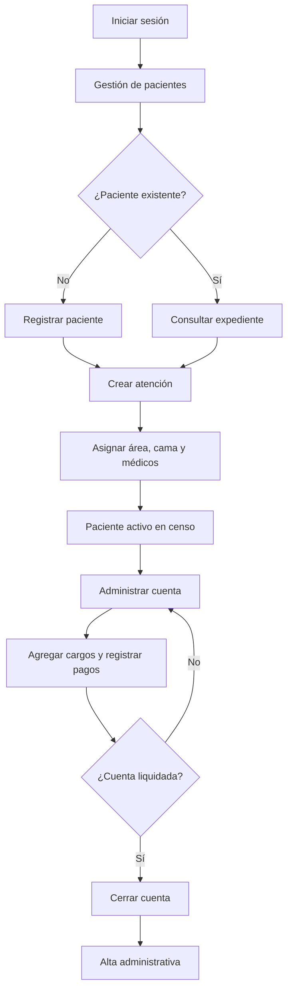

# Flujo de pacientes y procesos administrativos

**Proyecto:** Sistema de Gestión Clínica INEO  
**Sprint:** 2 — Pacientes y Administrativo  
**Responsable:** Jesús  
**Historias relacionadas:** PAC-001 a PAC-009

## 1. Objetivo

Documentar el recorrido del paciente dentro del módulo administrativo, desde su registro y creación de atención hasta la consulta de su cuenta y cierre administrativo. El flujo relaciona las pantallas del frontend React con los endpoints y servicios de la API Flask.

## 2. Participantes

| Participante | Responsabilidad |
|---|---|
| Administrador | Acceso completo a los módulos de pacientes y administración |
| Administrativo | Registro, consulta, actualización, censo, cuentas y corte de caja |
| Sistema React | Captura datos, presenta información y envía solicitudes a la API |
| API Flask | Valida permisos, procesa reglas y responde con datos JSON |
| MongoDB | Conserva expedientes, atenciones, cargos, pagos y catálogos |

Las rutas administrativas están protegidas mediante token JWT y requieren el rol `admin` o `administrativo`.

## 3. Flujo general



## 4. Acceso al módulo

1. El usuario inicia sesión en INEO.
2. La API devuelve un token y el rol autorizado.
3. React conserva la sesión y habilita las rutas administrativas.
4. El usuario ingresa a **Gestión de pacientes**.
5. El sistema solicita la información mediante `GET /api/v1/gestion-pacientes`.
6. La pantalla muestra pacientes activos, expedientes y altas.

Si el token no es válido, la API devuelve 401 y el frontend elimina la sesión local.

## 5. Registro de un paciente

### 5.1 Datos capturados

| Sección | Campos principales |
|---|---|
| Datos personales | CURP, primer apellido, segundo apellido, nombres, fecha de nacimiento y teléfono |
| Datos de atención | Área, cama, motivo, especialidad y alergias |
| Médicos asignados | Selección de hasta cinco médicos disponibles |
| Familiar responsable | Nombre, parentesco y teléfono |

### 5.2 Secuencia

1. El usuario presiona **Nuevo paciente**.
2. React consulta `GET /api/v1/options` para cargar áreas, camas, motivos, especialidades y médicos.
3. El usuario captura los datos obligatorios: CURP, primer apellido, nombres y fecha de nacimiento.
4. Selecciona los datos de la atención y los médicos responsables.
5. El formulario construye un objeto JSON que incluye `assignedDoctors`.
6. React envía `POST /api/v1/patients`.
7. La API valida contenido, permisos y reglas de negocio.
8. El servicio administrativo crea el expediente y la atención correspondiente.
9. La API devuelve 201 cuando el registro es correcto.
10. El frontend regresa al listado de pacientes.

### 5.3 Resultado esperado

- El paciente recibe un número de expediente.
- La atención queda asociada al expediente.
- El paciente aparece en el grupo correspondiente y en el censo si permanece activo.
- La cama seleccionada refleja su ocupación cuando corresponde.

## 6. Consulta y búsqueda

La pantalla muestra tablas agrupadas con expediente, paciente, edad, teléfono, área, cama y acciones disponibles. La búsqueda visible filtra los registros cargados y la API también dispone de búsqueda rápida mediante:

```http
GET /api/v1/patients/search?q=<texto>&limit=10
```

El usuario puede:

- Buscar por información disponible del paciente.
- Cambiar de página dentro de cada grupo.
- Abrir el detalle y la cuenta.
- Editar los datos del expediente.
- Actualizar manualmente la información mostrada.

## 7. Actualización del paciente

1. En el listado se presiona **Editar**.
2. React abre `/pacientes/:id/editar`.
3. Se consulta `GET /api/v1/patients/{id_exp}`.
4. El formulario combina datos personales, atención activa y familiar responsable.
5. El usuario modifica los campos necesarios.
6. React envía `PUT /api/v1/patients/{id_exp}`.
7. La API valida y actualiza los datos.
8. El sistema regresa al listado.

No se debe crear un expediente nuevo cuando únicamente se corrigen datos de uno existente.

## 8. Censo hospitalario

El censo concentra pacientes activos y los organiza por secciones. La pantalla presenta métricas de pacientes activos, áreas y avisos, además de:

- Número de atención o cuenta.
- Paciente y expediente.
- Área o habitación.
- Médico responsable.
- Motivo de atención.
- Avisos administrativos o clínicos.

Flujo:

1. El usuario abre **Censo**.
2. React solicita `GET /api/v1/censo?all=true`.
3. Flask consulta y organiza la información activa.
4. React permite búsqueda y paginación por sección.
5. El usuario puede actualizar los datos desde la barra de la pantalla.

## 9. Cuenta del paciente

### 9.1 Consulta

1. Se selecciona un paciente o una cuenta activa.
2. React carga la lista mediante `GET /api/v1/cuenta-pacientes`.
3. Al abrir una cuenta, consulta `GET /api/v1/cuenta-pacientes/{id_atencion}`.
4. Se muestran subtotal, impuestos, total, pagos y saldo pendiente.

### 9.2 Cargos

El administrativo selecciona un servicio o medicamento, define cantidad y confirma el cargo. React envía:

```http
POST /api/v1/accounts/{id_atencion}/charges
```

Para eliminar un cargo solicita confirmación y utiliza:

```http
DELETE /api/v1/accounts/{id_atencion}/charges/{charge_id}
```

### 9.3 Pagos

Los pagos se registran mediante:

```http
POST /api/v1/accounts/{id_atencion}/payments
```

La API actualiza el total pagado y el saldo de la cuenta. El importe debe ser válido y no debe registrarse dos veces por una repetición accidental de la petición.

### 9.4 Documentos

Desde la cuenta pueden descargarse documentos como hoja inicial, carátula, contrato, consentimiento y hoja de identificación. El frontend solicita el archivo como `blob` y crea la descarga en el navegador.

## 10. Corte de caja

1. El usuario abre **Corte de caja**.
2. React solicita `GET /api/v1/corte-caja`.
3. La pantalla muestra ingresos, movimientos y cuentas activas.
4. Los movimientos incluyen hora, paciente, concepto, método e importe.
5. Desde una cuenta activa puede abrirse el detalle del paciente.

Los reportes complementarios permiten generar cortes y exportaciones desde los endpoints del módulo de reportes y facturación.

## 11. Cierre de cuenta

1. El usuario revisa cargos, pagos y saldo.
2. Presiona **Cerrar cuenta**.
3. React solicita confirmación.
4. Envía `POST /api/v1/accounts/{id_atencion}/close`.
5. Flask ejecuta el cierre mediante el servicio administrativo.
6. La API devuelve la cuenta actualizada y el mensaje de éxito.
7. El paciente deja de aparecer como cuenta activa cuando corresponde.

Si existe una condición que impide el cierre, la API devuelve 400 con la descripción del error.

## 12. Flujos alternos y errores

| Situación | Respuesta esperada |
|---|---|
| Sesión vencida | Código 401 y retorno al inicio de sesión |
| Rol sin autorización | Código 403 y acceso rechazado |
| Campos obligatorios vacíos | El formulario impide el envío o la API devuelve 400 |
| Paciente inexistente | Código 404 |
| CURP o datos duplicados | Código 400 con mensaje descriptivo |
| Cama no disponible | No se asigna y se informa el conflicto |
| Error de conexión | Se conserva la pantalla y se muestra el mensaje de la petición |
| Cargo inválido | No se modifica la cuenta y se devuelve 400 |
| Documento no disponible | Se informa el error y no se genera una descarga vacía |
| Error interno | Código 500 sin exponer detalles sensibles |

## 13. Reglas de negocio documentadas

- Solo `admin` y `administrativo` operan el módulo.
- Un expediente identifica al paciente y una atención identifica su ingreso o servicio actual.
- La edición reutiliza el expediente existente.
- La asignación de médicos desde la interfaz se limita a cinco.
- Los cargos y pagos siempre se relacionan con `id_atencion`.
- El censo refleja principalmente atenciones activas.
- El cierre de cuenta requiere confirmación del usuario.
- Los archivos descargados no deben almacenarse nuevamente en el repositorio.

## 14. Criterios de aceptación

- El usuario autorizado puede registrar, buscar, consultar y editar pacientes.
- Las opciones del formulario se cargan desde la API.
- El censo muestra la situación de los pacientes activos.
- La cuenta permite consultar cargos, pagos, total y saldo.
- Los documentos administrativos pueden descargarse cuando existen.
- El corte de caja presenta movimientos y cuentas activas.
- Los errores no dejan datos parciales ni exponen información sensible.
