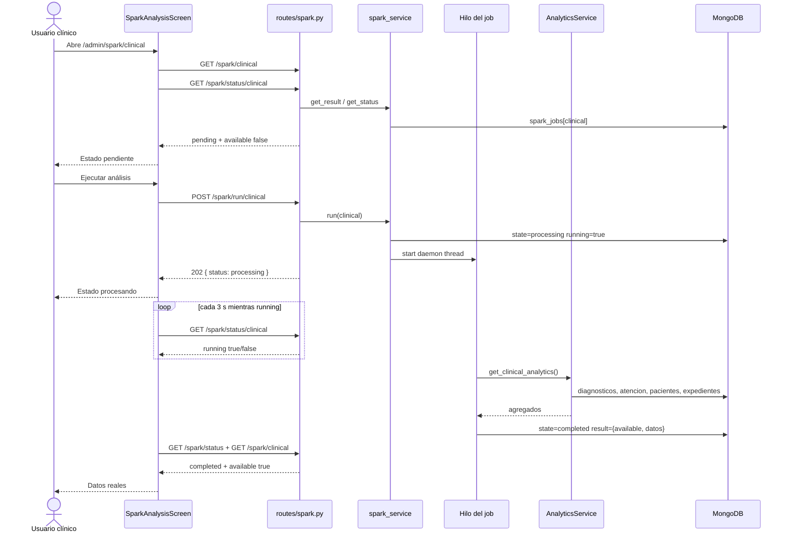

# PBL-03-T2 — Diseño del flujo de ejecución, estado y carga del resultado clínico

**Sistema:** Sistema de Gestión Clínica INEO  
**Historia:** PBL-03 — Ejecutar el análisis clínico y visualizar sus resultados  
**Tarea:** T2 — Definir componentes, contrato, flujo de datos, estados y manejo de errores. Alinear el diseño con la arquitectura existente.  
**Sprint:** 7  
**Repositorio:** `ineo-pbl-entrega`  
**Documento previo:** `docs/sprints/sprint-7/pbl-03-t1-revision-flujo-clinico.md`  
**Fecha de diseño:** 22 de septiembre de 2026  
**Responsable:** Jaime Diaz González 
**Estado:** Diseñado. **Sin cambios de código en esta tarea.**

---

## 1. Objetivo

Fijar el diseño que T3 debe programar para corregir:

1. ejecución del análisis clínico (`POST /spark/run/clinical`);
2. consulta de estado (`GET /spark/status/clinical`);
3. carga del resultado (`GET /spark/clinical`).

Criterio de aceptación:

> La interfaz cambia entre pendiente, procesando, completado y fallido; al completarse muestra datos reales.

Este diseño **reutiliza** Flask + Mongo + JWT + React ya presentes. No introduce un microservicio, ni PySpark, ni un estado global nuevo en el frontend.

---

## 2. Decisiones de alineación (cerradas en T2)

| Tema | Decisión | Motivo |
|---|---|---|
| Contrato HTTP | Conservar las rutas de `sparkService.js` | El cliente ya está escrito; T3 implementa el servidor que ese cliente espera. |
| Cálculo clínico | Reutilizar `AnalyticsService.get_clinical_analytics()` | Ya agrega Mongo (`diagnosticos`, `atencion`, `pacientes`, `expedientes`) y devuelve datos reales agregados. |
| Motor Spark | No añadir `pyspark` en PBL-03 | No está en `requirements.txt` ni en el despliegue. El criterio pide datos reales, no el runtime Spark. |
| Job | Asíncrono: `POST /run` responde de inmediato y el trabajo corre en un hilo daemon | `spark.md` y la UI (polling 3 s) exigen no bloquear HTTP. |
| Persistencia del job | Colección Mongo `spark_jobs`, un documento por `type` | Gunicorn puede tener varios workers; la memoria de proceso no es fuente de verdad. |
| Auth | `token_required` + `role_required` | Mismo patrón que `routes/analytics.py`. |
| Roles del flujo clínico | `admin`, `administrativo`, `medico` | La UI actual deja entrar admin/administrativo; la historia pide usuario clínico (`medico`); `GET /analytics/clinical` ya admite `admin` + `medico`. |
| Alcance de tipos | Implementar job real solo para `clinical` | analytics / met / unsupervised quedan fuera de PBL-03, con `available: false` y estado `pending`. |
| Frontend | Seguir usando `src/pages/spark/` | `src/spark/` está muerta; no se diseña sobre ella. |
| i18n de nombres | T3 mapea a claves existentes; T4 agrega `pending` y `completed` | T3 no debe mezclarse con traducciones. |

---

## 3. Componentes

No se crean pantallas nuevas. Se completa el hueco backend y se ajusta el mapeo de estados en la pantalla ya existente.

### 3.1 Componentes existentes (conservar)

```text
frontend/clinica-web-react/src/pages/spark/ClinicalAnalyticsScreen.jsx
frontend/clinica-web-react/src/pages/spark/SparkAnalysisScreen.jsx
frontend/clinica-web-react/src/pages/spark/SparkDashboard.jsx
frontend/clinica-web-react/src/pages/spark/Spark.css
frontend/clinica-web-react/src/services/sparkService.js
frontend/clinica-web-react/src/services/api.js
frontend/clinica-web-react/src/router/AppRouter.jsx
frontend/clinica-web-react/src/components/layout/Sidebar.jsx
frontend/clinica-web-react/src/i18n/locales/es.json
frontend/clinica-web-react/src/i18n/locales/en.json
backend/api_hospital/services/analytics_service.py   → get_clinical_analytics()
backend/api_hospital/middleware/auth_middleware.py
backend/api_hospital/utils/database.py
```

### 3.2 Componentes nuevos (T3)

| Componente | Responsabilidad |
|---|---|
| `backend/api_hospital/services/spark_service.py` | Estados del job, arranque asíncrono, persistencia en `spark_jobs`, invocación del cálculo clínico, armado del resultado. |
| `backend/api_hospital/routes/spark.py` | Blueprint `/spark`: overview, run, status, result. Validación de tipo, auth y códigos HTTP. |
| `backend/api_hospital/tests/test_spark_clinical.py` | Run → processing → completed → GET clinical; 401/403/400/409. |

### 3.3 Componentes a tocar con cambio mínimo

| Archivo | Cambio en T3 | Cambio en T4 |
|---|---|---|
| `backend/api_hospital/app.py` | `register_blueprint(spark_bp, url_prefix=f'{config.API_PREFIX}')` | — |
| `SparkAnalysisScreen.jsx` | Mapear `pending`/`idle` al estado pendiente; `completed` + `available` a datos | Textos `pending`/`completed` |
| `AppRouter.jsx` / `Sidebar.jsx` | — | Abrir `/admin/spark/clinical` a `medico` |
| `es.json` / `en.json` | — | Claves de estado del criterio |
| `docs/manual-tecnico/spark.md` | — | Marcar SPK-001…004 de clinical como implementados |

### 3.4 Responsabilidades (quién hace qué)

```text
ClinicalAnalyticsScreen
    solo pasa type="clinical"

SparkAnalysisScreen
    pinta estados, dispara run, hace polling, muestra datos
    NO calcula indicadores

sparkService
    traduce métodos HTTP; no guarda estado local persistente

spark.py (Flask)
    auth, validación, códigos HTTP, no contiene agregaciones Mongo

spark_service.py
    máquina de estados + orquestación del job

AnalyticsService.get_clinical_analytics
    única fuente de indicadores clínicos
```

---

## 4. Contrato HTTP

Prefijo real: `/api/v1` (`config.API_PREFIX`). El cliente Axios ya lo antepone.

Tipos válidos: `analytics` | `met` | `clinical` | `unsupervised`.  
PBL-03 implementa el job **solo** en `clinical`.

Todos los endpoints Spark exigen JWT Bearer.

### 4.1 `GET /spark/overview`

**Roles:** `admin`, `administrativo`, `medico`.

```json
{
  "analytics": { "available": false },
  "met": { "available": false },
  "clinical": { "available": true, "state": "completed" },
  "unsupervised": { "available": false }
}
```

`SparkDashboard` solo lee `overview[type].available`. El campo `state` es informativo para T4/debug.

### 4.2 `POST /spark/run/{type}`

**Roles:** los del tipo. Para `clinical`: `admin`, `administrativo`, `medico`.

El frontend hace `setStatus(response.status)`. El cuerpo **debe** anidar `status`.

Respuesta **202**:

```json
{
  "status": {
    "state": "processing",
    "running": true,
    "type": "clinical",
    "started_at": "2026-09-22T14:10:00.000Z",
    "finished_at": null,
    "log": null
  }
}
```

Si ya hay un job `processing` del mismo tipo → **409** (no se lanza otro).  
Si `{type}` no es válido → **400**.

### 4.3 `GET /spark/status/{type}`

El frontend hace `setStatus(next)` con el JSON **en la raíz** (no anidado).

```json
{
  "state": "processing",
  "running": true,
  "type": "clinical",
  "started_at": "2026-09-22T14:10:00.000Z",
  "finished_at": null,
  "log": null
}
```

Estados canónicos de `state`:

| `state` | `running` | Significado |
|---|---|---|
| `pending` | `false` | Nunca ejecutado o reiniciado. Criterio: **pendiente**. |
| `processing` | `true` | Job en curso. Criterio: **procesando**. |
| `completed` | `false` | Terminó. Criterio: **completado**. |
| `failed` | `false` | Terminó con error. Criterio: **fallido**. |

Compatibilidad con la UI actual: T3 puede emitir también `idle` como alias de `pending` **o** mapear `pending` a la rama `notRun` en el front. No se inventa un quinto estado de negocio.

### 4.4 `GET /spark/clinical`

Resultado persistido del último job `clinical`, no una consulta en vivo distinta del job.

**Completado con datos:**

```json
{
  "available": true,
  "timestamp": "2026-09-22T14:10:04.000Z",
  "type": "clinical",
  "top_diagnosis": [
    { "diagnosis": "J18.9", "count": 12 }
  ],
  "age_distribution": [
    { "range": "30", "count": 8 }
  ],
  "average_stay_days": 3.4,
  "visualizations": []
}
```

**Pendiente (nunca ejecutado):**

```json
{
  "available": false,
  "timestamp": null,
  "type": "clinical",
  "visualizations": []
}
```

**Completado sin indicadores (Mongo vacío):** `available: false` y `state` del status = `completed`. La UI usa `spark.states.empty`.

**Fallido:** este GET puede devolver `available: false`; el estado `failed` vive en `/status`. No se fabrican métricas.

Campos que el front **no** pinta como sección: `available`, `timestamp`, `visualizations`. Cualquier otra clave con contenido se muestra. Por eso los nombres `top_diagnosis`, `age_distribution` y `average_stay_days` se conservan.

`visualizations` queda `[]` en PBL-03. No se generan gráficos falsos.

### 4.5 Tipos fuera de alcance

`GET /spark/analytics|met|unsupervised` responden 200:

```json
{ "available": false, "timestamp": null, "type": "analytics", "visualizations": [] }
```

`POST /spark/run/analytics|met|unsupervised` responde **400**:

```json
{ "error": "Tipo de análisis no implementado en PBL-03" }
```

Así no se simula un módulo que la matriz aún marca incompleto.

---

## 5. Modelo de datos del job

Colección Mongo: `spark_jobs`.  
Clave: `type` (único).

```json
{
  "type": "clinical",
  "state": "processing",
  "running": true,
  "started_at": "2026-09-22T14:10:00.000Z",
  "finished_at": null,
  "log": null,
  "result": null,
  "requested_by": "usuario",
  "role": "medico"
}
```

Al completar, `result` guarda el JSON de `GET /spark/clinical` (agregados, sin `Id_exp`, nombres ni expedientes).

Índice: único por `type`.

Documento inicial si no existe: `state=pending`, `running=false`, `result=null`.

---

## 6. Flujo de datos



### 6.1 Ciclo de vida del job clínico

```text
        (documento ausente)
                │
                ▼
            pending ──────────────────────────────┐
                │ POST /run válido                │
                ▼                                 │
           processing                             │
             │            │                       │
     cálculo OK     excepción / timeout           │
             │            │                       │
             ▼            ▼                       │
        completed      failed                     │
             │            │                       │
             │            └── POST /run ──► processing
             └── POST /run ──► processing (re-ejecución)
```

Reglas:

- De `processing` no se acepta otro `POST /run` → 409.
- `GET /status` y `GET /clinical` nunca lanzan el cálculo.
- El hilo escribe el documento **antes** de terminar; el polling solo lee.
- Timeout de seguridad del job: 60 s. Si se excede → `failed` con log `Tiempo de espera agotado al ejecutar el análisis clínico`.
- Re-ejecutar desde `completed` o `failed` sustituye `result` anterior.

---

## 7. Estados de interfaz (criterio PBL-03)

Fuente de verdad: `GET /spark/status/{type}`.  
`loading` y `offline` son estados de red locales, no del job.

| Criterio | `status.state` | `status.running` | `data.available` | UI actual (T3) | i18n T4 |
|---|---|---|---|---|---|
| Pendiente | `pending` | false | false | rama `notRun` | `spark.states.pending` |
| Procesando | `processing` | true | (se ignora) | rama `processing` | `spark.states.processing` |
| Completado | `completed` | false | true | paneles + galería | datos; opcional badge `completed` |
| Completado vacío | `completed` | false | false | rama `empty` | `spark.states.empty` |
| Fallido | `failed` | false | false | rama `failed` + `status.log` | `spark.states.failed` |
| Cargando consulta | — | — | — | rama `loading` | se conserva |
| Sin API | error sin `response` | — | — | `offline` | se conserva |

Prioridad de pintado en T3 (misma que hoy, con `pending` equivalente a `idle`):

1. error de red / HTTP de carga
2. `loading`
3. `running` o `state in {pending (si running), processing}` → **ojo:** `pending` **sin** `running` no es procesando
4. `state === 'failed'`
5. `!available && (idle|pending)` → pendiente
6. `!available` → vacío
7. datos reales

Ajuste mínimo en `SparkAnalysisScreen.jsx` (T3):

```text
status.state === 'idle' || status.state === 'pending'  →  pendiente
status.running || status.state === 'processing'        →  procesando
status.state === 'failed'                              →  fallido
data.available                                         →  completado con datos
```

Hoy la rama de procesando también trata `state === 'pending'` como procesando. Eso **debe corregirse**: `pending` sin `running` es el estado inicial, no un job activo.

---

## 8. Manejo de errores

Formato uniforme del backend:

```json
{ "error": "mensaje para UI o log" }
```

| Caso | HTTP | `error` | UI |
|---|---|---|---|
| Sin token | 401 | `Token no proporcionado` | interceptor de `api.js` (limpia sesión) |
| Token inválido/expirado | 401 | `Token inválido o expirado` | igual |
| Rol no autorizado | 403 | `Permisos insuficientes` | estado error + mensaje |
| Tipo desconocido | 400 | `Tipo de análisis no válido` | no arranca job |
| Tipo no implementado (no clinical) | 400 | `Tipo de análisis no implementado en PBL-03` | igual |
| Job ya en curso | 409 | `El análisis clínico ya se está procesando` | mantener procesando; no resetear |
| Mongo no disponible | job → `failed` | log interno; status 200 en GET | estado fallido |
| Excepción de agregación | job → `failed` | log recortado, sin secretos | estado fallido |
| Timeout 60 s | job → `failed` | `Tiempo de espera agotado al ejecutar el análisis clínico` | estado fallido |
| Fallo de red (sin response) | — | — | `spark.states.offline` |
| 404 de Spark (regresión) | 404 | `Recurso no encontrado` | error, **no** empty |

El `POST /run` no espera al cálculo. Un fallo de negocio **después** de aceptar el job no es 500 del POST: es `state=failed` visible en `/status`.

500 solo si falla la orquestación (no se pudo escribir `spark_jobs` al aceptar el run).

Logs: texto corto, sin URI Mongo, sin JWT, sin dumps de pacientes.

---

## 9. Permisos (diseño; cableado en T4)

| Recurso | `admin` | `administrativo` | `medico` | otros |
|---|---|---|---|---|
| `GET /spark/overview` | sí | sí | sí | 403 |
| `POST /spark/run/clinical` | sí | sí | sí | 403 |
| `GET /spark/status/clinical` | sí | sí | sí | 403 |
| `GET /spark/clinical` | sí | sí | sí | 403 |
| UI `/admin/spark` | sí | sí | sí (T4) | no |
| UI `/admin/spark/clinical` | sí | sí | sí (T4) | no |
| UI analytics / met / unsupervised | sí | sí | no | no |

T3 puede dejar la UI como está (admin/administrativo) e implementar los roles en la API. T4 abre la ruta clínica al médico y las traducciones. Las pruebas 403 de API sí nacen en T3.

---

## 10. Seguridad y datos

- Resultado agregado: diagnósticos, rangos de edad, promedio de estancia. Prohibido devolver `Id_exp`, nombres, teléfonos o rutas de estudios.
- Re-ejecución no concatena historiales clínicos en el JSON de salida; sustituye el último resultado.
- Colección `spark_jobs` no se incluye en evidencias ni en Git.
- Pruebas: fixture `TEST` de `tests/fixtures/sprint1_data.json` o documentos sintéticos aislados.
- CORS y JWT no se rediseñan.

---

## 11. Pruebas de diseño (para T3/T4)

| ID | Caso | Resultado esperado |
|---|---|---|
| CL-01 | GET status sin job previo | `pending`, `running: false` |
| CL-02 | GET clinical sin job previo | `available: false` |
| CL-03 | POST run clinical | 202, `status.state=processing`, `running: true` |
| CL-04 | GET status durante el job | `processing` |
| CL-05 | POST run con job activo | 409 |
| CL-06 | Al terminar con datos | `completed` + `available: true` + tres bloques reales |
| CL-07 | Al terminar sin datos | `completed` + `available: false` |
| CL-08 | Fallo forzado (Mongo caído o excepción inyectada) | `failed` + `log` |
| CL-09 | Tipo `no-existe` | 400 |
| CL-10 | POST run `met` | 400 no implementado |
| CL-11 | Sin token | 401 |
| CL-12 | Rol `enfermero` | 403 |
| CL-13 | UI: pendiente → procesando → completado | capturas T4 |
| CL-14 | UI: fallido + reintentar | capturas T4 |

---

## 12. Fuera de alcance

- Implementar PySpark, PCA o K-Means (PBL de unsupervised).
- Generar PNG de visualizaciones.
- Cambiar `GET /analytics/clinical` (se mantiene para otros consumidores).
- Rediseñar `Spark.css` salvo un estado `completed` si T4 lo necesita.
- Refactor de `src/spark/` (carpeta muerta; T4 decide borrar o ignorar).
- Datos reales de pacientes en evidencias.

---

## 13. Plan de implementación que T3 debe seguir

1. Crear `spark_service.py` con `ALLOWED_TYPES`, `get_status`, `get_result`, `run`, worker de `clinical`.
2. Crear `routes/spark.py` y registrarlo en `app.py`.
3. Ajustar el mapeo `pending` vs `processing` en `SparkAnalysisScreen.jsx` (un cambio local, sin i18n nueva).
4. Escribir `test_spark_clinical.py` cubriendo CL-01 a CL-12.
5. No tocar Sidebar, AppRouter ni JSON de idiomas (T4).

Si T3 necesita un contrato no listado aquí, se actualiza este documento **antes** de programarlo.

---

## 14. Conclusión de T2

El arreglo de PBL-03 es un **job asíncrono clínico** detrás del contrato que el frontend ya consume, alimentado por `AnalyticsService.get_clinical_analytics()`, persistido en `spark_jobs` y expuesto con los cuatro estados del criterio.

T2 queda cerrada con este documento. La programación corresponde a **PBL-03-T3**.

---

## 15. Evidencia de T2

| Entregable | Ruta |
|---|---|
| Este diseño | `docs/sprints/sprint-7/pbl-03-t2-diseno-flujo-clinico.md` |
| Commit esperado | `docs(pbl-03): definir contrato y estados del análisis clínico` |
| Rama | `feature/pbl-03-analisis-clinico` |
